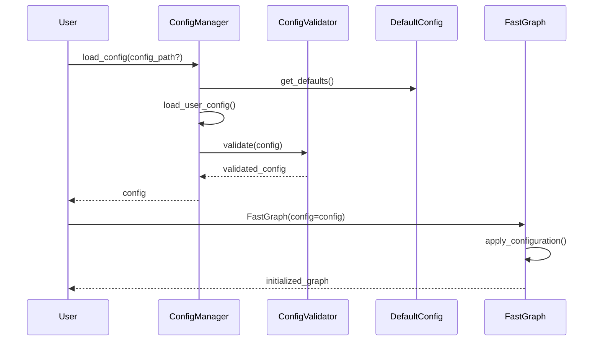
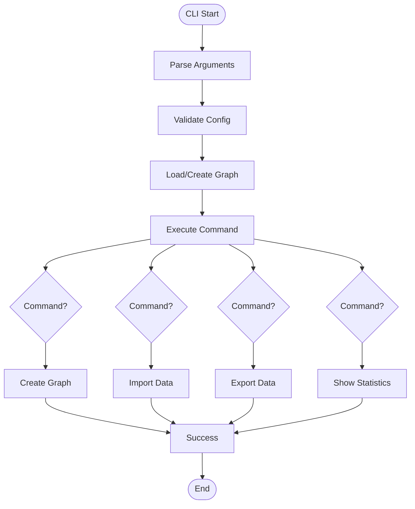
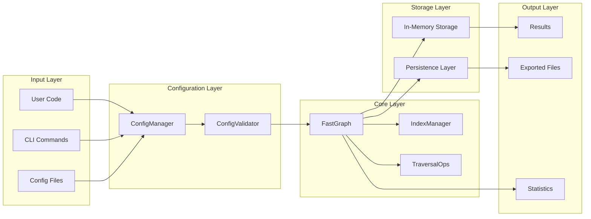

# FastGraph System Architecture

## Overview Diagram

```mermaid
graph TB
    subgraph "Package Structure"
        A[fastgraph/] --> B[__init__.py]
        A --> C[core/]
        A --> D[config/]
        A --> E[cli/]
        A --> F[utils/]
        A --> G[exceptions.py]
        A --> H[types.py]
    end
    
    subgraph "Core Module"
        C --> C1[graph.py - FastGraph]
        C --> C2[edge.py - Edge]
        C --> C3[subgraph.py - SubgraphView]
        C --> C4[indexing.py - IndexManager]
        C --> C5[traversal.py - TraversalOps]
        C --> C6[persistence.py - Persistence]
    end
    
    subgraph "Config Module"
        D --> D1[manager.py - ConfigManager]
        D --> D2[defaults.py - DefaultConfig]
        D --> D3[validator.py - ConfigValidator]
    end
    
    subgraph "CLI Module"
        E --> E1[main.py - CLI Entry]
        E --> E2[commands.py - Commands]
        E --> E3[utils.py - CLI Utils]
    end
    
    subgraph "Utils Module"
        F --> F1[threading.py - ThreadSafety]
        F --> F2[cache.py - CacheManager]
        F --> F3[memory.py - MemoryUtils]
    end
    
    subgraph "External Interfaces"
        I[User Code]
        J[CLI Commands]
        K[Config Files]
        L[PyPI Package]
    end
    
    I --> B
    J --> E1
    K --> D1
    B --> C1
    L --> A
```



## Configuration Flow



## CLI Command Flow



## Data Flow Architecture



## Component Interactions

### Core Components
1. **FastGraph**: Main graph database class
   - Manages nodes, edges, and indexes
   - Provides thread-safe operations
   - Handles caching and performance optimizations

2. **ConfigManager**: Configuration management
   - Loads and validates configurations
   - Handles priority resolution
   - Provides configuration access

3. **CLI Interface**: Command-line tools
   - Provides user-friendly commands
   - Handles argument parsing
   - Manages graph file operations

### Key Design Patterns
1. **Singleton Pattern**: Configuration manager
2. **Factory Pattern**: Graph creation with different configs
3. **Observer Pattern**: Index maintenance
4. **Strategy Pattern**: Different persistence formats
5. **Command Pattern**: CLI command implementation

## Performance Optimations

### Memory Management
- Efficient adjacency lists for O(1) lookups
- Memory-efficient subgraph views using weak references
- Compressed serialization with msgpack

### Caching Strategy
- LRU cache for query results
- Index-based query optimization
- Batch operations for bulk operations

### Thread Safety
- Read-write locks for concurrent access
- Thread-safe cache management
- Atomic operations for index updates

## Extensibility Points

### Custom Indexes
```python
class CustomIndex(BaseIndex):
    def build(self, graph):
        # Custom index implementation
        pass
```

### Custom Persistence
```python
class CustomPersistence(BasePersistence):
    def save(self, graph, path):
        # Custom save implementation
        pass
    
    def load(self, path):
        # Custom load implementation
        pass
```

### Custom CLI Commands
```python
@click.command()
def custom_command():
    # Custom CLI implementation
    pass
```

## Security Considerations

1. **File Access**: Validate file paths and permissions
2. **Configuration**: Secure handling of sensitive config values
3. **Serialization**: Safe deserialization of graph data
4. **Memory**: Protection against memory exhaustion attacks

## Testing Strategy

### Unit Tests
- Core functionality tests
- Configuration management tests
- CLI command tests
- Utility function tests

### Integration Tests
- End-to-end graph operations
- Configuration loading scenarios
- CLI workflow tests
- Performance benchmarks

### Test Coverage
- Minimum 90% code coverage
- All public APIs tested
- Error conditions covered
- Edge cases validated

This architecture provides a robust, extensible foundation for the FastGraph package while maintaining high performance and usability.